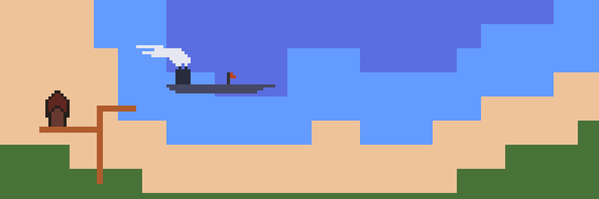

# Analysis

## Introduction

The problem to be solved is: an online multiplayer game that is real time and allows you to create civilisations and go to war with other players. What is this for? Entertainment. Or to be put bluntly: My laptop is dead and I want to play games with my friends but the games they have don't run on linux which my desktop has so I'm going to make a game that runs on linux and windows and then play it with my friend.

I'd like to connect people from different locations so it's most suited to be a comuter game and therefore needs a computer and internet connection to play it. Internet is the fastest form of communication and data transfer so making an online game so I can play with my friend who is not at my house makes more sense than making a board game and sending letters of our moves (which would be way too slow). However using a computer and networking means I need to learn some tools to make this possible including port forwarding so I can securely connect to my friend. The actual code will make use of procedural programming due to how much more manageable it makes things and the language I'll use is rust because it's fast and well structured and forces safe memory usage. Rust is also object orientated (uses structs in place of classes) so the code will have many functions to consider. It also doesn't allow global muteable variables due to its memory safety, which will make the project slightly more challenging but all the more fun to code.

The game will be called "MonarchyTiles" (or "MT" for short. This will be how the project will be referred to from now on) as it will be a 2D tile based system and players can own certain tiles and be a "monarch" to them.

The requirements to build this project are:

+ A game engine to be the main backbone of the project and allow the drawing to a window.
+ A way of connecting two machines either on a local network or potentialy a global one. Using a global network will require port forwarding which can cost money where a local network does not. However, a local network will only working for two machines connected to the same LAN.
+ Software to create art for the game.
+ Software to create music and sound effects for the game.



TM is inspired by a web game called "atWar", however atWar is based off a real map of earth and not randomly generated terrain. It allows you to take turns to buy and move units and rounds only move on once players have all agreed or done the maximum actions they can. MT will not be like this as players can move their "units" at any time. TM will also have the ability to expand empires peacefully and allow for trading between players. There should also be some automation involved as not everyone can be constantly on their computers playing a game. Automation would involve resource gathering, resource processing and resource transport. Allowing automation for anything else may cause the game to perform unwanted actions and reduce the need to play the game.

TM is written in rust because ~rust is cool~ it is a memory safe language which is important when handling large amounts of data.

The game engine it uses is a cargo library called macroquad. Cargo is a popular library manager used with rust and macroquad can be added by using `cargo add macroquad` in the project directory. It can there be used in the main program.

Another library it uses is called noise which includes the perlin noise function so that natural terrain can be procedurally generated.

## Stakeholders

The stakeholders for this project are mainly my friends as one of them said they'd be really interested in this game and would play it and also some people in a programming server. This is because it is quite easy to organise play testing sessions amongst these groups. Their roles in these sessions is to comment on the game and give any feedback for improvement that I can implement.


## Survey

Firstly people were asked if they like chess. Why? Because chess is a very popular strategy game and although it is a much smaller scale to MT it will attract similar people so people who do like chess should be taken more seriously as they are more likely to play MT. The survey was sent to some friends and also to programming discord servers so as no surprise most people answered "Yes" for this question meaning most other answers can properly treat the major answer as the most important.

The second question asked if people like pixel art games which is just to help decide if the art assets should be pixel art or not. It will be kept 2D for simplicity and due to its large scale as a 3D game of this scale would be much harder to optimise.

The third question asked if people would like a single player game mode. The answers to this had the option to vote for NPC monarchs which also was also chosen as the majority. This means that I will have to develop a more complex automisation which can have parts taken and given to players to give them an easier time playing the game especially if they have large cities to manage.

The fourth question asked if people would like to create their own flags for their kingdoms which was answered with 100% yes meaning I will need to create a small art program or allow importing of images. As the game is online this does create a higher risk for younger players seeing things they should not and therefore some sort of moderation options should be added or the age rating of the game would be raised to prevent younger audiences from playing and restricts the accessability of the game. Because of this I will likely just make an art editor that has a small area so that anything nsfw will not be obvious and younger audiences can still play and test the game.

The fifth question asked if their should be limits to servers such as player count and map size. Most people responded to this with "limit both" which is likely a good thing as lots of people connecting to a server with an unlimited map size could cause the map to exceed the memory of the server and suck up the bandwidth when requesting sectors of the map to draw.

The sixth question asked if the game should continue running even if not all players are online. For example playeer 1 is online but player 2 is not connected to the server. The reason this was asked is because it could create an unfair advantage for people who do not have to spend time on other aspects of life to gaming. Restricting this could also cause issues of players being able to hold servers hostage by not joining them and then preventing everyone else from playing the game. Due to this and also most people answering with "yes", the games will run even if not all players are online at any one time.

The seventh question of this servey asked if players should receive automation options for trading, transport and resource management as these tasks are very repetative and automating them would increase the quality of play time in the game. Likely due to this large benefit the question was answered 100% with "yes".

The eight question asked if people used windows or linux. This was asked as if enough people use both then the game will be compiled for both and there is an almost even split between the use of the operating systems so the game will have to be compiled for both.

The last question was open ended and allowed users to suggest something to add to the game. My favourite answer is "ability to create alliances" which would be a very cool and useful tool to have. Another answer was "a good management system" which I hope to succeed in making.


## Proposed solution

Firstly the specifications I am working with on my home computer are as follows:

```
OS: Arch Linux x86_64 
Host: HP Compaq Elite 8300 SFF 
Kernel: 6.13.2-arch1-1 
Resolution: 1680x1050, 1600x1200 
CPU: Intel i5-3470 (4) @ 3.600GHz 
GPU: NVIDIA GeForce GT 1030 
Memory: 11904MiB
```
This is quite different to most computers and likely less performant than what most people have these days. This also means that if the game runs on my computer then it will run on most computers which is great.

The success criteria is:

+ I can make new tiles to expand an empire and send troops to fight other players.
+ I can play the game and automate some tasks within the game
+ I can connect to my friend over the internet through a code and we can both play the game at the same time
+ I can save and pause the game for something like maintanence or just saving electricity
+ I can create a custom flag inside the game that other players can view and use to identify me and they can do the same so I may identify them
+ Some sort of way of communicating with players in game
+ There's a single player mode with bot kingdoms
+ Players can connect to a headless server which handles the connection and things that shouldn't be managed by any one player.

If all these are possible then it is a success.


